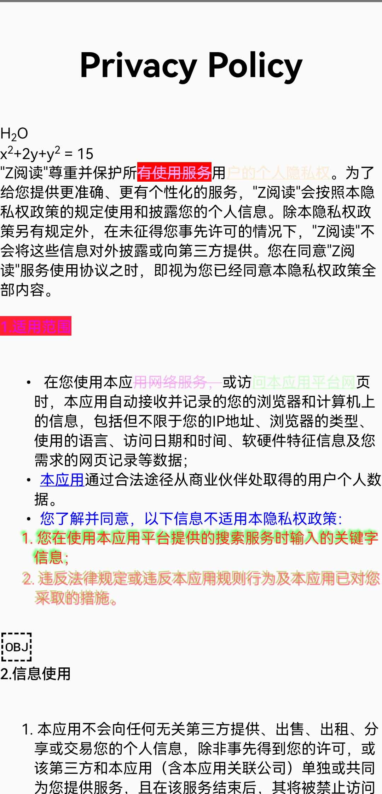

# htmlToAnnotatedString

#### 介绍
Compose 中的Text可以显示html的内容



### 支持的html标签如下
1. h1至h6
2. p,div,span
3. ol,ul,li
4. strong,b,em,cite,dfn,i
5. blockquote
6. a,u,del,ins,s,strike
7. sup,sub
8. img,br

### 支持的css属性
1. text-align
2. color (预定义的颜色名称，或 RGB、HEX、HSL、RGBA、HSLA 值)
3. background/background-color
4. text-decoration
5. text-shadow

#### 使用说明


```
Text(text = htmlToAnnotatedString(html))
```


#### 参与贡献


